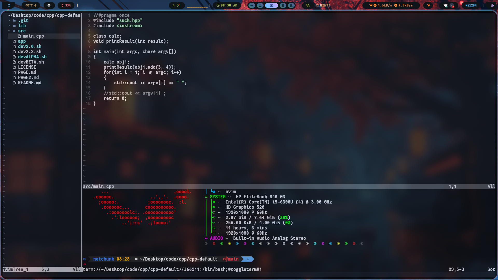

# This is a "Neovim Configuration" for beginners
>### This configuration will give you 'integrated terminal' and 'file tree' inside Neovim.
>
>
>### --- Keyboard Shortcuts ---
>* `ctrl + T`&nbsp;&nbsp;&nbsp;&nbsp;&nbsp;&nbsp;&nbsp;&nbsp;&nbsp;&nbsp;&nbsp;&nbsp;&nbsp;&nbsp;&nbsp;&nbsp;&nbsp;: toggles the file tree view \[ use arrow keys to navigate and <enter> to use \]
>* `ctrl + shift + T` : only shifts your focus toward file tree \[ not the opposite \]
>* `ctrl + alt + C` &nbsp;&nbsp;&nbsp;&nbsp;: Starts the integrated terminal if it doesn't exist
>* `ctrl + shift + F` : Toggles the integrated terminal [ only if the terminal is Started ]
>* `ctrl + <space>` &nbsp;&nbsp;&nbsp;&nbsp;: Turns on search commands [ exit that by <esc> ]
---
## If you have Neovim installed on your Linux System
>
>
>### Open any Terminal you have -- and follow this instruction page
>#### [ Run these commands to follow the ordered list's instruction ] 
>
>1. Open .config folder
> ```bash
> cd .config
> ```
>>> [[ click this ]  This is a shortcut if you have git installed on your system !!](source/PAGE2.md)
>2. Open nvim folder
> ```bash
> cd nvim
> ```
>>> 2.2. If nvim directory doesn't exist then create one
> >>```
> >>mkdir nvim
> >>```
>>> 2.3. Now do step "2" again and then try step "3"
>
>3. Open 'init.lua' file [ you can use nvim / vim / nano or anything ]
>* * If you are running from terminal and don't have the file it will automatically open a canvas named 'init.lua' and will apear as a file if you write, save and exit.
>```bash
>nano init.lua
>```
>>> 3.2. If the file doesn't exist and wanna create manually
>>>```bash
>>>touch init.lua
>>>```
>>> 3.3. Now follow step "3" again and then try step "4"
>4. Copy everything from 'init.lua' provided in this github repository
>4.2. paste, save and exit \[ in your init.lua \]
>
# You are all set !!  You can reopen Neovim to see changes :)


